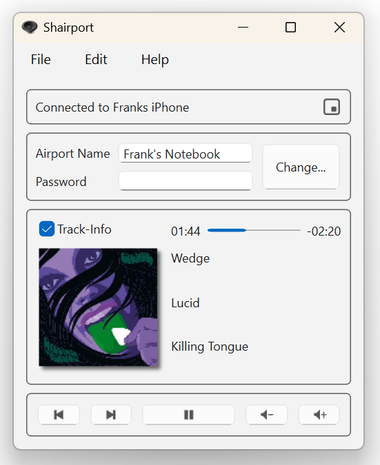
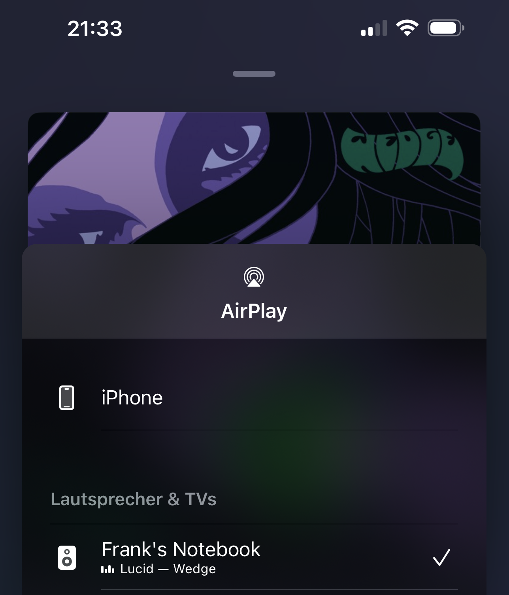

# ShairportQt

An AirPlay Audio-Receiver for your Personal Computer or ARM-SoC (e.g. Raspberry Pi).

Play audio content from your iPhone, iPad, iPod or iTunes on your PC with ShairportQt.
AirPlay lets you wirelessly stream what's on your iOS device whenever you see the AirPlay symbol.

This desktop-software was originally only available for Windows.
But now it's based on `Qt` and is therefore completely portable/cross platform. Additionally many bugs have been fixed - compared to the
previous version (Shairport4w).

Please download precompiled binaries from [`Releases`](https://github.com/Frank-Friemel/ShairportQt/releases).
If asked by your Firewall, you should grant access to your LAN if you are on a secure network. Protect ShairportQt with a password
to be sure nobody is misusing this service.

## Installation

ShairportQt consists of a single executable file. So, there's not much to install. Nevertheless I would like to provide
some hints for the various operating systems which worked for me. When updating your existing installation, please
do the same, but make sure to close the running instance of ShairportQt first.

#### Windows (x64 and arm64)

The [`Releases`](https://github.com/Frank-Friemel/ShairportQt/releases) section contains a setup executable.

Alternatively you may install manually by just downloading the `zip` file and copying the file `ShairportQt.exe` to your filesystem and create a Desktop-Link. That's it.

> **New:** `ShairportQt` does *not* require Apple-Bonjour anymore. If you've installed it previously, feel free to uninstall Apple-Bonjour services, if no other applications depend on them.

On my `Arm64` device `Smart App Control` prevented `ShairportQt` from starting. I needed to disable `Smart App Control`. `ShairportQt` is open
source and the compiled binaries are not signed. Nevertheless they can be trusted.

#### Linux (x64)

The installation for Linux depends a bit on your Linux distribution.
I myself am using [`Manjaro-Linux`](https://manjaro.org/)
which worked out of the box and I would expect the same for all KDE-based distributions. You'll need at least `Qt 6.7` installed on your machine.

The [releases](https://github.com/Frank-Friemel/ShairportQt/releases) package contains an installation script. So, for now you need to unpack the
[zip](https://github.com/Frank-Friemel/ShairportQt/releases) file, open a terminal, change-directory to
`Linux_x64` and start script `install.sh` as superuser:

```shell
chmod a+x install.sh
sudo ./install.sh
```

Afterwards `ShairportQt` application should be available from your start menu.

#### Raspbian (arm64)

The [releases](https://github.com/Frank-Friemel/ShairportQt/releases) package contains an installation script. So, for now you need to unpack the
[zip](https://github.com/Frank-Friemel/ShairportQt/releases) file, open a terminal, change-directory to
`Raspbian` and start script `install.sh` as superuser:

```shell
chmod a+x install.sh
sudo ./install.sh
```

Afterwards `ShairportQt` application should be available from your start menu.

## Problem reports

When you have issues with `ShairportQt` please provide the following information:

- Operating System you're using.
- The device/software which connects to `ShairportQt`
- Detailed steps on how to reproduce.
- a log file. Which may be enabled from the advanced options dialog. The log file `ShairportQt.log` will be created within your home folder. Alternatively start `ShairportQt` with command line option `-log`.

## Building

`ShairportQt` is a `CMake` project. You'll need a complete c++ development environment and these packages to build it:

- `openssl`
- `spdlog`
- `sockpp`
- `qtbase`
- `WinToast`
- `gtest`

I recommend to use `vcpkg` in order to get them.
It works very well on Linux and Windows.

On Windows just open `ShairportQt` as CMake project with Visual Studio.
On Linux you may use Visual Studio Code or build from the command line (assumed you're using `vcpkg`):

```shell
git clone https://github.com/Frank-Friemel/ShairportQt.git
cd ShairportQt
mkdir build
cd build
cmake .. -DCMAKE_TOOLCHAIN_FILE=${VCPKG_ROOT}/scripts/buildsystems/vcpkg.cmake -DCMAKE_BUILD_TYPE=Release
cmake --build .
```

### Credits

Thanks to James Laird who implemented the original version of "Shairport".
Special thanks to Japanese Translator [maborosohin](https://github.com/maboroshin).

### Screenshots

<p float="left" align="center">





</p>

### Usage Hints

Click on the time marker to the right of the progress bar to toggle between different display modes.

ShairportQt offers a tray icon which may be
disabled. If the function `Show "Now Playing" in Tray` is switched on, title information will only appear in
the tray if the main window is not visible on the desktop.
To completely hide/restore the main window from the taskbar you have to click
on the tray icon (for `Windows` users, a double click may work as well). A tray menu
will show up when you right click on the tray icon. The option "Start minimized" will
minimize the application window to the tray, if the tray icon is enabled.

The multimedia buttons at the bottom of the main window are being used to remotely control
your connected device. This also applies to the volume buttons, so it's
*not* your local volume which will increase/decrease.

ShairportQt allows you to start multiple process-instances with different configurations. All you need to
do is to provide a name for your instance configuration by applying the command line parameter
`-config=MyConfigurationName`. The allowed characters for the configuration-name
are limited to characters `A-Z`, `a-z` and `0-9`.

ShairportQt supports multiple languages. Your preferred language is being detected automatically, usually.
In case you would like to set it manually ... please edit the file `.ShairportQt_Config.json` which is located
in your home folder. The format is `json`. So, please be sure **not** to break the config when you're making
changes (e.g. please add a comma, if it's not the last entry). You may set the key `Language` to one of these values:

- `en-EN` for English
- `de-DE` for German
- `es-ES` for Spanish
- `ca-ES` for Catalan
- `ja-JP` for Japanese

Example forcing the language to be Japanese:

```shell
"Language": "ja-JP",
```

> **Important:** Manually editing the config works only when `ShairportQt` **is not running**

#### System Integrated Media Control

ShairportQt integrates its controls into your system. Windows calls this `SMTC`, Linux calls it `MPRIS`. The purpose is the same — allowing the system or other applications to control installed media applications. If you don't need or want this feature, you may disable it by unchecking the checkbox in the `options` dialog.

Please keep in mind that ShairportQt is designed to act as a media server. The client is the device sending the music, which connects to ShairportQt. So if the remote device disconnects its controls from ShairportQt, those controls will also become unavailable to `SMTC`/`MPRIS`.

### Avahi (aka Bonjour)

The latest version of ShairportQt does not depend on Apple's Bonjour anymore. Instead the Windows built-in service discovery functions
are used.

On my Raspbian ... I had to install `libavahi-compat-libdnssd-dev`.

```sh
sudo apt install libavahi-compat-libdnssd-dev
```

For other Linux distributions, the package name is different:

- **Fedora:** `avahi-compat-libdns_sd`

Also you may need to enable/start the `avahi-daemon`:

```sh
sudo systemctl enable avahi-daemon
sudo systemctl start avahi-daemon
```

On some Linux distributions you may have to install `avahi` via their own desktop installation tool. Please see my
Video [Installation of ShairportQt on Suse](https://youtu.be/UIfek93D5Hw).

